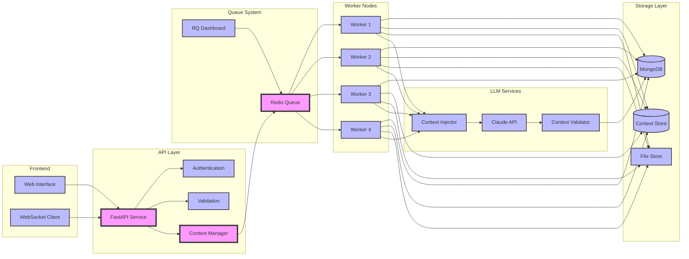

# Chelle Knowledge Management System

A comprehensive system for managing organizational knowledge through concepts, relationships, and operational elements.

## Overview

Chelle Knowledge Management System is a web-based application that helps organizations structure, visualize, and maintain their knowledge base. The system is built with Python/FastAPI backend and Streamlit frontend, offering three main components:

1. **Concepts Management**

   - Define and organize organizational knowledge
   - Track definitions, citations, and understanding levels
   - Manage synonyms and related terms

2. **Relationships Management**

   - Create and visualize connections between concepts
   - Support different relationship types and strengths
   - Interactive network visualization
   - Track relationship evolution over time

3. **Operational Elements**
   - Implement concepts in practical contexts
   - Manage procedures, tools, and validations
   - Track operational status and coverage

## Technology Stack

### Core Infrastructure
- **Containerization**: Docker with configurable scaling (20 API instances, 4 workers)
- **Load Balancing**: NGINX reverse proxy
- **Caching & Queues**: Redis
- **Database**: MongoDB with persistent storage
- **Development Tools**: Jupyter Lab, RQ Dashboard

### Backend Services
- **API**: FastAPI with Uvicorn ASGI server
- **Workers**: Python RQ (Redis Queue) for parallel processing
- **Resource Management**: CPU/memory limits per container
- **AI Integration**: Anthropic Claude API via AWS Bedrock
- **Monitoring**: Langfuse for observability

### Frontend
- **Framework**: Next.js (replacing Streamlit)
- **Real-time Updates**: WebSocket support
- **Static Assets**: Optimized serving via NGINX
- **Development**: Hot-reload capability

### Development Environment
- **Interactive**: Jupyter Lab integration
- **Monitoring**: RQ Dashboard for queue visualization
- **Dependencies**: Comprehensive Python package management
- **Initialization**: Automated setup and fixture loading

## Installation

1. Clone the repository:

```bash
git clone [repository-url]
cd chelle-knowledge-management
```

2. Build and run with Docker:

```bash
docker-compose up --build
```

3. Access the application:
   - Frontend: http://localhost:3000
   - API: http://localhost:8000
   - Worker Monitor: http://localhost:9181
   - Jupyter Lab: http://localhost:8888

## System Architecture



## Project Structure

```
.
├── api/                      # Backend API service
│   ├── main.py              # FastAPI application entry
│   ├── models/              # Pydantic models
│   ├── routers/             # API endpoints
│   ├── services/            # Business logic
│   ├── jobs/               # Background job processors
│   └── utils/              # Shared utilities
├── docker/                  # Docker configuration
│   ├── backend/            # API service Dockerfile
│   └── frontend/           # Next.js Dockerfile
├── frontend/               # Next.js frontend
│   ├── src/               # Source code
│   │   ├── app/          # Next.js pages
│   │   ├── components/   # Reusable components
│   │   └── hooks/        # Custom React hooks
├── prompts/               # LLM prompt templates
│   ├── concept_definer.py
│   ├── concept_identifier.py
│   └── concept_researcher.py
├── filestore/             # Uploaded file storage
├── init.py               # System initialization
└── nginx.conf           # NGINX configuration
```

## Features

### Concepts Management

- Create and edit concept definitions
- Track citations and sources
- Manage synonyms and understanding levels
- View concept history and evolution

### Relationships Management

- Create connections between concepts
- Multiple relationship types:
  - Equivalence (1.0)
  - Subsumption (0.8)
  - Overlap (0.6)
  - Related (0.4)
  - Disjoint (0.2)
- Connection types:
  - Causal
  - Temporal
  - Spatial
  - Functional
- Interactive network visualization
- Relationship strength metrics

### Operational Elements

- Implementations
  - Track practical applications of concepts
  - Manage implementation details and status
- Procedures
  - Define step-by-step processes
  - Link procedures to concepts
- Tools
  - Document tool usage and purpose
  - Connect tools to relevant concepts

## API Integration

The system integrates with Anthropic's Claude API for automated:

- Concept identification
- Definition synthesis
- Relationship suggestions

API endpoints are available at:

- `/api/chat`: Handle chat interactions
- Root endpoint (`/`): Health check

## Development

### Prerequisites

- Python 3.8+
- Docker
- AWS credentials (for Anthropic Bedrock)

### Local Development

1. Create a virtual environment:

```bash
python -m venv venv
source venv/bin/activate  # Linux/Mac
# or
.\venv\Scripts\activate  # Windows
```

2. Install dependencies:

```bash
pip install -r docker/requirements.txt
```

3. Run the development server:

```bash
streamlit run frontend/Home.py
```

### Environment Variables

Required environment variables:

- `AWS_ACCESS_KEY_ID`: AWS access key
- `AWS_SECRET_ACCESS_KEY`: AWS secret key
- `AWS_REGION`: AWS region (default: us-east-1)

## Contributing

1. Fork the repository
2. Create a feature branch
3. Commit your changes
4. Push to the branch
5. Create a Pull Request

## License

[License details to be added]

## Support

For support, please [contact information to be added]
