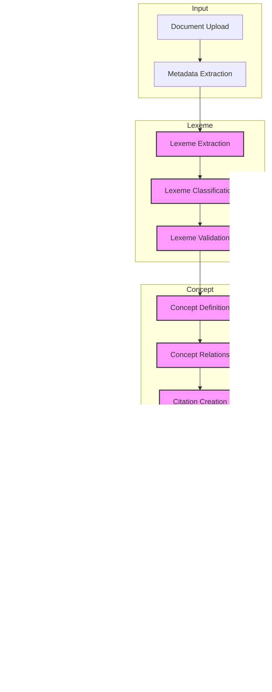

# Title: Augmented Knowledge Base Creation and Curation using Large Language Models: A Proof-of-Concept Implementation

## I. Introduction

### General Problem Statement.

- Organizations struggle to efficiently extract, organize, and utilize knowledge from their unstructured textual data. This challenge encompasses:
  - Information Overload
    - the volume of documents and data within organizations is growing exponentially. (Taylor, P, 2023, Gartner, 2023)
  - Knowledge Silos
    - important information is often scattered across different departments, systems, versions, documents (Deloitte, 2020)
  - Manual Curation
    - traditional methods of knowledge organization rely heavily on manual effort (Chui, M. et al., 2012)
  - Lack of Standardization
    - challenging to integrate information from diverse sources (AIIM, 2023)
  - Rapid Obsolescence
    - knowledge can quickly become outdated, requiring constant updates (Tamayo, et al., 2023)
  - Domain Specificity
    - each organization or industry has its own specialized vocabulary and concepts solutions (Otero, et al., 2015)
  - Accessibility
    - even when knowledge is properly organized, it may not be easily accessible (Cross, et al., 2004)
  - Scalability
    - knowledge management systems often struggle to keep pace with growth (Heisig, et al., 2016)

### Background on LLMs and Knowledge Management

- Evolution and challenges of knowledge management systems
  - Historical reliance on manual curation
    - From Assignment 1: "Manual curation has been expensive and time-consuming. According to Karp (2016), the high costs associated with manual curation of knowledge bases make alternative strategies necessary, though these may result in lower quality knowledge."
  - Growing inefficiencies in traditional approaches
    - From Assignment 3: "Workers spend 19% of their time searching for and gathering information" (Chui et al., 2012)
    - "55% of organizations report that knowledge silos are a significant barrier to effective decision-making" (Deloitte, 2020)
  - Scale and complexity challenges
    - From Assignment 3: "A study of 179 multinational corporations found that as organizations grew in size and complexity, the effectiveness of their knowledge management systems decreased. Specifically, companies with over 10,000 employees reported a 23% lower satisfaction rate with their knowledge management systems compared to smaller firms" (Heisig et al., 2016)
- Emergence of LLMs as powerful text processing tools
  - From Assignment 2: "Pre-LLM era research predominantly pointed towards transformer-based BERT models for knowledge extraction tasks. What I'm seeing in this research is that the future lies in leveraging existing LLMs, especially those provided by major providers such as OpenAI, Anthropic, and Google."
  - Can cite: Caufield et al. (2024) "SPIRES: A method for populating knowledge bases using zero-shot learning"
- Current approaches to LLM-based knowledge extraction
  - From Assignment 1: "The integration of large language models (LLMs) into natural language processing techniques has revolutionized knowledge extraction and ontology development."
  - Can cite: Babaei Giglou et al. (2023) "LLMs4OL: Large language models for ontology learning"
  - Can cite: Wan et al. (2023) regarding in-context learning for relation extraction
- Challenges in leveraging LLMs effectively
  - From Assignment 3: "The challenge lies in developing efficient, accurate, and scalable methods to extract knowledge from diverse document sources, map this knowledge to existing ontologies, and present it in a form that is useful for non-expert users."
- Context limitations
  - Can cite: Wang et al. (2023) "GPT-NER: Named Entity Recognition via Large Language Models"
- Hallucination issues
  -Can cite: Bikeyev (2023) "Synthetic ontologies: A hypothesis"

- Overview of Proposed Solution

  - Introduction to the Chelle Knowledge Model (CKM)
  - System architecture for knowledge processing
  - Integration of LLMs with structured knowledge models
  - Human-in-the-loop validation approach
  - Scalable processing pipeline

- Contributions
  - Novel approach to structuring LLM interactions using CKM
  - Proof-of-concept implementation demonstrating feasibility
  - Insights into practical challenges of LLM-based knowledge processing
  - Framework for context-aware knowledge extraction
  - Architectural patterns for scalable knowledge processing

## II. The Chelle Knowledge Model (CKM)

### Overview and Motivation

- Traditional knowledge bases lack context management
- Knowledge meaning and relationships evolve with context
- Need for formal framework to preserve semantic integrity
- LLMs demonstrate context-sensitivity but require structure

### Comparison with Existing Approaches

Traditional RAG: Document retrieval and LLM synthesis
Direct KM-LLM Interface: Pre-constructed knowledge model interaction
Key differentiators in architecture and capabilities

### Design Principles

- Explicit context tracking and versioning
- Preservation of core concept definitions
- Formal relationship modeling across contexts
- Computationally verifiable validation
- Bidirectional traceability

### Core Components

1. Knowledge Representation

   - Base definitions independent of context
   - Context-specific extensions and relationships
   - Validation rules for semantic consistency
   - Version control for knowledge evolution

2. Context Framework

   - Explicit context declaration
   - Context hierarchy and inheritance
   - Relationship preservation across contexts
   - Context-specific validation rules

3. Integration Layer
   - LLM interaction patterns
   - Context injection methods
   - Response validation frameworks
   - Knowledge extraction rules

### Case Study: "Basis" in Linear Algebra

Demonstrates how CKM manages evolving concept understanding:

1. Base Definition:

   - Mathematical definition: linearly independent vectors spanning vector space
   - Core properties: independence, spanning, uniqueness

2. Context Evolution:

   - Week 5: Building intuition via random vectors
   - Week 7: Application to Central Limit Theorem
   - Context inheritance: maintains core definition while adding domain relevance

3. Validation Mechanisms:
   - Core property preservation
   - Context-specific relationship validation
   - Dependency tracking across context changes

This case study shows CKM's ability to:

- Maintain semantic consistency
- Support natural knowledge evolution
- Preserve relationships across contexts
- Guide LLM interactions systematically

## III. System Architecture

- High-level system design
  - Distributed microservices architecture
  - Asynchronous processing model
  - Event-driven communication
  - Docker containerization strategy
  - Load distribution and scaling approach
- Component overview
  - API service
    - FastAPI implementation
    - RESTful endpoints for document processing
    - WebSocket support for real-time updates
    - Rate limiting and request validation
    - Authentication and authorization
  - Worker nodes
    - Redis Queue worker implementation
    - Parallel processing capabilities
    - Job management and monitoring
    - Failure handling and retry logic
    - Resource management
  - Storage layer
    - MongoDB document store
    - Document versioning strategy
    - Indexing for efficient retrieval
    - Change data capture
    - Backup and recovery
  - Processing pipeline
    - Document ingestion and parsing
    - Lexeme extraction workflow
    - Concept processing stages
    - Knowledge base updates
    - Validation queue management
  - Integration patterns
    - Event-driven communication via Redis
    - RESTful service integration
    - Webhook notifications
    - Batch processing protocols
    - Error handling and recovery patterns

## IV. Knowledge Processing Pipeline

### Document Processing

- Initial context classification
  - Domain identification
  - Audience level detection
  - Prerequisite mapping
  - Teaching sequence position

### Knowledge Extraction

- Context-aware lexeme identification
- Relationship detection within context
- Cross-context relationship mapping
- Context transition detection
- Validation against CKM rules

### Context Management

- Context hierarchy construction
  - Inheritance relationships
  - Context transitions
  - Dependency tracking
  - Version management

### Storage Architecture

- Context-preserving schema design
- Context-based indexing
- Relationship preservation
- Change tracking across contexts
- Version control implementation

### Human-in-Loop Validation

- Context appropriateness verification
- Relationship validation
- Context transition review
- Knowledge evolution approval
- Quality metrics by context

## V. CKM-LLM Integration

### Context-Aware Prompting

- Context injection techniques
- Context hierarchy representation
- Prerequisite knowledge incorporation
- Learning sequence position
- Domain relevance signals

### Response Processing

- Multi-context validation
- Context-specific parsing rules
- Relationship extraction by context
- Cross-context consistency checks
- Version conflict resolution

### Knowledge Integration

- Context mapping to CKM structure
- Relationship preservation
- Context transition management
- Dependency validation
- Version control integration

### Quality Control

- Context-specific validation rules
- Cross-context consistency checks
- Relationship integrity verification
- Evolution tracking
- Context appropriateness metrics

### Implementation Strategy

- Context representation format
- LLM interaction patterns
- Response validation framework
- Storage integration approach
- Human review workflow

## VI. Implementation

- Technical stack details

  - Core infrastructure
    - Docker containerization and orchestration
    - NGINX reverse proxy and load balancing
    - Redis for job queues and caching
    - MongoDB for document and knowledge storage
  - Backend services
    - FastAPI for high-performance API endpoints
    - Python workers for parallel processing
    - Jupyter integration for research and development
    - RQ (Redis Queue) for job management
  - Frontend
    - Next.js for user interface
    - Real-time updates via WebSocket
    - Interactive document visualization

- Key implementation decisions

  - Asynchronous processing model for scalability
  - Modular prompt system for flexible LLM interaction
  - Change data capture for knowledge base versioning
  - Human-in-the-loop validation workflow
  - Containerized microservices for deployment flexibility

- Challenges encountered

  - High-throughput parallel processing limitations
  - Context management across multiple LLM calls
  - Job queue optimization for large documents
  - Resource constraints with multiple LLM requests
  - State management across distributed system

- Solutions developed
  - Implemented worker pool with configurable scaling
  - Developed structured prompt templating system
  - Created batching strategy for LLM requests
  - Built monitoring and observability tools
  - Designed failure recovery mechanisms

## VII. Discussion

- System capabilities and limitations
- Scaling considerations
- Lessons learned
- Future work

Knowledge Model Scaling

Telescoping KM implementation
Context-aware knowledge scope management
Performance optimization for large knowledge bases

Evaluation Framework

Metrics for knowledge interface effectiveness
User interaction analysis
System performance benchmarking

## VIII. Conclusion

- Summary of contributions
- Implications for knowledge management
- Next steps

## Appendix

Association for Intelligent Information Management (AIIM). (2023, April 20). _2023 State of the Intelligent Information Management Industry_. AIIM. https://www.aiim.org/industrywatch2023
Chui, M., Manyika, J., Bughin, J., Dobbs, R., Roxburgh, C., Sarrazin, H., Sands, G., & Westergren, M. (2012, July 1). _The social economy: Unlocking value and productivity through social technologies_. McKinsey Global Institute. https://www.mckinsey.com
Cross, R., & Sproull, L. (2004). More than an answer: Information relationships for actionable knowledge. Organization science, 15(4), 446-462.
Deloitte. (2020). _2020 Deloitte Global Human Capital Trends: The social enterprise at work: Paradox as a path forward_. Deloitte Development LLC. https://www2.deloitte.com/content/dam/Deloitte/us/Documents/human-capital/us-2020-deloitte-global-human-capital-trends.pdf
Gartner, Inc. (2023, May 10). _Gartner survey reveals 47% of digital workers struggle to find the information needed to effectively perform their jobs_. https://www.gartner.com/en/newsroom/press-releases/2023-05-10-gartner-survey-reveals-47-percent-of-digital-workers-struggle-to-find-the-information-needed-to-effectively-perform-their-jobs
Heisig, P., Suraj, O. A., Kianto, A., Kemboi, C., Perez Arrau, G., & Fathi Easa, N. (2016). Knowledge management and business performance: global experts’ views on future research needs. Journal of Knowledge Management, 20(6), 1169-1198.
Otero-Cerdeira, L., Rodríguez-Martínez, F. J., & Gómez-Rodríguez, A. (2015). Ontology matching: A literature review. Expert Systems with Applications, 42(2), 949-971.
Tamayo, J., Doumi, L., Goel, S., Kovács-Ondrejkovic, O., & Sadun, R. (2023). Reskilling in the age of AI: Five new paradigms for leaders—and employees. _Harvard Business Review_, 101(5), 86–95. https://hbr.org/2023/09/reskilling-in-the-age-of-ai
Taylor, P. (2023, November 16). _Volume of data/information created, captured, copied, and consumed worldwide from 2010 to 2020, with forecasts from 2021 to 2025 (in zettabytes)_. Statista. https://www.statista.com/statistics/871513/worldwide-data-created/
