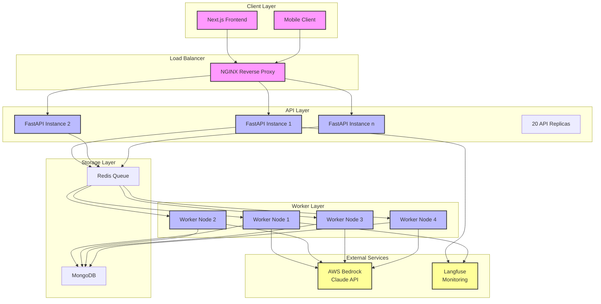
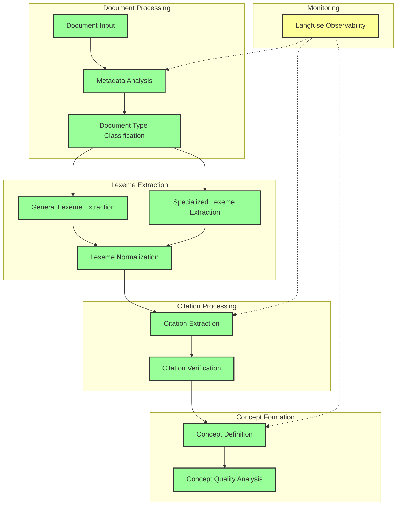

# Problem

## Knowledge Management Crisis

- 19% of time spent searching information (Chui et al., 2012)
- Exponential data growth (Taylor, 2023)
- Departmental silos impair decision-making (Deloitte, 2020)
- Currency challenges in rapidly evolving fields (Tamayo et al., 2023)

::: notes
Organizations face substantial challenges in managing institutional knowledge. Studies show employees spend nearly one-fifth of their time searching for information. This represents both operational and productivity costs.

The challenge is multifaceted:
1. Information volume growing exponentially
2. Knowledge trapped in departmental silos
3. Maintaining currency in rapidly evolving fields
4. Traditional approaches showing decreasing effectiveness with scale
:::

# Solution

## The Chelle Knowledge Model (CKM)

## The Chelle Knowledge Model (CKM)

- Three-layer architecture:
  1. Conceptual Layer
  2. Relationship Layer
  3. Operational Layer
- Mathematical formalism
- Human-in-the-loop validation
- Automated knowledge extraction

::: notes
The Chelle Knowledge Model (CKM) represents a fundamental shift in knowledge management. It's built on a three-layer architecture that provides a complete framework for knowledge organization.

Key innovations:
- Conceptual Layer handles lexeme identification and concept formation
- Relationship Layer manages formal knowledge connections
- Operational Layer transforms abstract concepts into concrete implementations

Each layer maintains strict mathematical formalism while preserving semantic relationships.
:::

## Core Operations

Three fundamental knowledge processing operations:

:::::::::::::: {.columns}
::: {.column width="40%"}

1. Entity extraction
2. Relationship extraction
3. Ontological mapping
:::
::: {.column width="60%"}

:::
::::::::::::::

::: notes
The CKM implements three core operations essential for effective organizational knowledge management:

1. Entity extraction identifies and classifies knowledge components
2. Relationship extraction discovers and formalizes connections
3. Ontological mapping creates structured knowledge hierarchies

These operations work together to create a complete knowledge processing pipeline.
:::

# Implementation

## Architecture

- Docker + Microservices
- FastAPI + Redis Queue
- MongoDB storage
- Next.js frontend
- AWS Bedrock integration
- Langfuse monitoring

## Architecture

::: notes
The implementation uses a modern, scalable architecture:

- Docker containers for modular deployment
- FastAPI for RESTful endpoints
- Redis Queue for distributed processing
- MongoDB for flexible document storage
- Next.js for responsive frontend
- AWS Bedrock for LLM integration
- Langfuse for comprehensive monitoring

Currently running 20 API replicas and 4 worker nodes.
:::

## Processing Pipeline

::: notes
The knowledge processing pipeline consists of four main stages:

1. Document Classification and Metadata Extraction
   - Domain-specific prompts
   - Multiple document categories
   
2. Lexeme Extraction
   - General-purpose and domain-specific extractors
   - Structured prompt repository

3. Citation Processing
   - Supporting evidence extraction
   - Scalability considerations

4. Concept Formation
   - Synthesis of lexemes and citations
   - JSON-based prompt structure
:::

# Challenges

## Technical Hurdles

- Asynchronous processing at scale
- Worker load balancing complexity
- Debug complexity in distributed systems
- Performance bottlenecks with rich documents

::: notes
Implementation revealed several key challenges:

1. Asynchronous Processing:
   - Handling concurrent lexeme processing
   - Managing distributed state
   - Monitoring task progression

2. Load Balancing:
   - Initial API-level approach insufficient
   - Worker-level balancing required refactoring
   - Resource utilization optimization

3. Debugging:
   - Complex asynchronous operations
   - Delayed processing functions
   - Need for comprehensive tracing
:::

# Results

## Implementation Status

Component Status:

- Core functionality proven viable
- Document processing pipeline complete
- Storage and queue management implemented
- Several features remain theoretical

::: notes
The proof-of-concept implementation has validated our core architectural decisions:

Completed Components:
- Document classification
- Basic lexeme extraction
- Core processing pipeline
- API server architecture
- MongoDB implementation
- Redis queue management

Theoretical Components:
- Human-in-the-loop validation
- Relationship extraction
- Citation verification
- Complete operational layer
:::

# Future

## Next Steps

- Complete relationship extraction system
- Implement validation framework
- Optimize worker performance
- Expand monitoring capabilities
- Develop assessment framework
- Deploy learning structure

::: notes
Looking ahead, our focus is on several key areas:

1. Completing core functionality:
   - Relationship extraction system
   - Validation framework implementation
   - Worker performance optimization

2. Expanding capabilities:
   - Comprehensive monitoring
   - Assessment framework
   - Learning structure deployment

3. Validation and scaling:
   - Real-world application testing
   - Performance optimization
   - System scalability

The goal remains making ontology creation as accessible as database management, enabling new approaches to organizational knowledge management.
:::