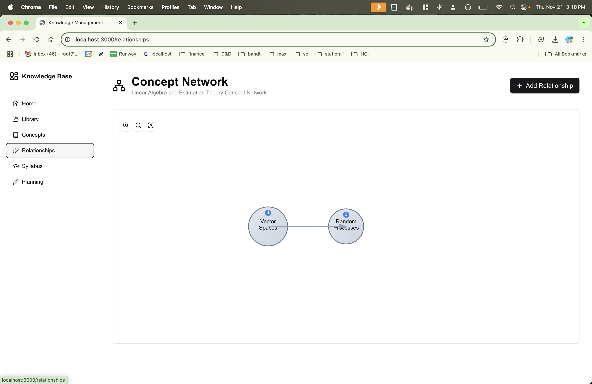

This project proposes an innovative approach to automated knowledge extraction and ontology mapping using Large Language Models (LLMs). Building on my own 20+ years of education and AI engineering expertise, I aim to develop a sophisticated system that integrates advanced Named Entity Recognition (NER), entity relation extraction, and ontology mapping to generate organization-specific ontologies.

Milestone 2 marks progress including the implementation of core APIs, database schema deployment, and integration of monitoring tools. The asset processing pipeline is now functional, and key UI components are ready for user testing. All code is available on GitHub [[link]](https://github.com/joshuacook/gatech-edtech-final-project).

Demo video: [[link]](https://www.youtube.com/watch?v=ONInng8iyv8)

## Knowledge Model


### Purpose

Chelle manages an organization’s information via construction of a knowledge model (KM) for that organization.

A KM is used for:

- Encoding an organization’s knowledge (concepts, definitions, facts, relationships)
- Organizing an organization’s documents (documents are tagged by concept)

- [Link to knowledge model document](https://docs.google.com/document/d/11CvzD2tzcr5AR687tzRomErBrjm3j__IDkaYsZkOR1s)

\pagebreak

## Key Accomplishments

- **Core API Development**: Implemented and tested all essential APIs
- **Database Schema**: Deployed database collections for documents, processing metadata, and content properties
- **UI Components**: Completed several key interfaces, with mock versions available for advanced features, which will become functional within the next two weeks.
- **Monitoring Tools**: Integrated Langfuse and RQ Monitor for performance tracking and error analysis
- **Pipeline Verification**: Verified asset processing pipeline

## Platform Overview

Chelle is an AI-native intelligent education platform that transforms unstructured information into courses, materials, and an asynchronous and personalized learning experience. Instructors can upload a variety of formats, such as course notes, textbooks, and lecture recordings, which are then transformed by Chelle's AI into a custom knowledge model for each course.

### Key Differentiators and Benefits

- **Course-Specific Knowledge Models**: Unlike traditional LLMs, Chelle builds course-specific ontologies that maintain context without additional prompting, allowing for tailored learning progression.
- **Personalized Learning Paths**: Students receive personalized content based on course timelines and their learning needs.
- **Cross-Course Alignment**: Enhanced consistency across departments and courses eliminates knowledge silos and ensures clear progression of concepts.

## Core API Implementation

### Asset Processing Pipeline

The asset processing pipeline is at the heart of our document and content management strategy, providing the following capabilities:

- **Refined Content Processing**: Handles comprehensive content refinement to prepare documents for advanced analysis.
- **Lexeme Extraction**: Extracts domain-specific lexemes crucial for semantic understanding and content categorization. This feature allows the system to maintain context specific to each educational course, directly supporting Chelle's goal of personalized content creation.
- **Table Extraction**: Automates table data extraction for structured data retrieval.
- **Image Processing**: Facilitates image analysis and extraction for visual content inclusion.
- **Metadata Processing**: Processes metadata to enhance document searchability and organization.
- **Document Splitting**: Splits documents into manageable sections for more efficient processing.
- **Citation and Definition Processing**: Extracts citations and definitions to support research and reference management.

### Knowledge Model APIs

Knowledge Model APIs provide the foundation for managing and organizing domain-specific information:

- **Concept Management**: CRUD operations to create, update, and maintain core concepts that reflect the structured learning progression unique to each course.
- **Implementation and Procedure Management**: Tools for managing how concepts are applied practically.
- **Tool Management**: Management of associated tools for each concept.
- **Relationship Management**: Define and manage relationships between concepts, including metrics to measure the effectiveness of these relationships, which aids in cross-course consistency and content alignment.
- **Operational Element Mapping**: Map key operational elements to ensure coherence across all knowledge models.

### File Management

The file management system is designed for seamless handling of document assets:

- **Upload Functionality**: Allows users to upload diverse document types for processing.
- **Content Retrieval**: Retrieves content for user interaction and further processing.
- **Table/Image Extraction**: Provides dedicated extraction tools for structured data and images.
- **Metadata Management**: Manages document metadata to ensure comprehensive tracking and accessibility.

## Prompt Library Structure

The prompt library is structured to support efficient asset and concept processing workflows:

```
prompts/
- assets/
  - citation/       # Citation handling
  - image/          # Image processing
  - lexeme/         # Domain-specific lexeme extraction
  - table/          # Table processing
- concept/
  - citations/      # Citation management
```

This structure ensures that prompts are easily accessible and organized for asset-specific and concept-specific processing needs.

## Database Schema Implementation

The database schema underpins the core functionality by providing well-defined collections to track and manage documents:

### Key Collections

1. **Documents**

   - **Metadata Tracking**: Comprehensive metadata for each document.
   - **Processing Status**: Tracks the stage of document processing.
   - **File Paths and Hashes**: Ensures data integrity and easy retrieval.
   - **Error Handling**: Logs any processing errors for troubleshooting.
   - **Content Analysis Metrics**: Records metrics for quality assessment.
   - **Lexeme Extraction Results**: Captures extracted lexemes for reference.

2. **Processing Metadata**

   - **Completeness Scoring**: Measures document processing completeness.
   - **Quality Assessment**: Evaluates content quality.
   - **Domain Specificity Analysis**: Identifies how closely content aligns with the domain.
   - **Time Sensitivity Tracking**: Monitors the relevance of content over time.
   - **Accessibility Features**: Ensures processed content meets accessibility standards.

3. **Content Properties**

   - **Formality Levels**: Tracks the tone of the content.
   - **Target Audience Identification**: Identifies intended audiences.
   - **Terminology Density**: Measures the concentration of specialized terms.
   - **Information Coherence Metrics**: Assesses the logical flow of information.

## Supporting Applications

### Langfuse Integration

- Provides prompt monitoring, performance tracking, and error analysis to ensure high-quality responses and model outputs. This helps improve prompt accuracy over time as the platform evolves.

### RQ Monitor

- Manages job queues, tracks processing status, and reports errors, enabling efficient handling of processing tasks.

### Jupyter Environment

- Used for prompt testing, model experimentation, and performance analysis, supporting ongoing development and refinement of models.

## UI Implementation

The user interface development has focused on delivering intuitive tools for interacting with the system:

\pagebreak

### Home Dashboard

Provides an overview of the system's features and status.


\pagebreak

### Library Management

Allows users to manage content libraries effectively.


\pagebreak

### Concepts Interface

A mock-up interface to manage key concepts, which will become functional within the next two weeks.


\pagebreak

### Relationship Viewer

A mock-up interface to visualize relationships between concepts.



\pagebreak

### Syllabus Manager

A mock-up interface to organize content into syllabi for educational purposes.


\pagebreak

### Planning Tools

A mock-up interface to strategic planning of content and knowledge structures.


\pagebreak

## Current Status and Next Steps

- **All core APIs** have been implemented and thoroughly tested, ensuring robust system performance.
- **Database schema** is fully deployed, supporting data integrity and efficient content management.
- **UI Components** are ready for user testing, with core interfaces completed and mock-ups for future development.
- **Processing Pipeline** has been verified as operational, providing reliable content processing.
- **Monitoring Tools** (Langfuse and RQ Monitor) have been successfully integrated to enhance system visibility and troubleshooting.
- **Documentation** is complete, ensuring all stakeholders have access to necessary information.

### Next Steps

- **User Testing**: Begin user testing of UI components to gather feedback and identify areas for improvement.
- **Feature Enhancement**: Refine mock interfaces based on user feedback and implement additional features.
- **Optimization**: Continue optimizing the processing pipeline for performance and scalability, even though scalability isn't a focus during this R&D phase.

## Challenges and Solutions

- **Challenge**: Managing the complexity of asset processing for varied document types.

  - **Solution**: Developed specialized APIs for each processing step, allowing more modular and focused handling.

- **Challenge**: Ensuring database scalability with complex metadata requirements.
  - **Solution**: Carefully designed schema to optimize both storage and retrieval, focusing on key use cases. Scalability is currently not a primary focus, as this is an R&D application.
